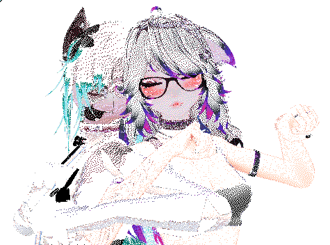
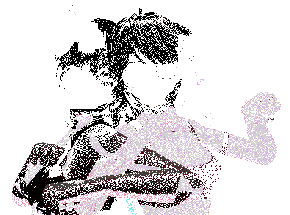
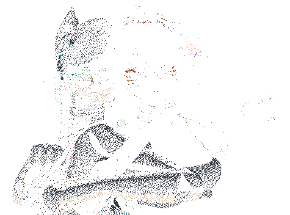
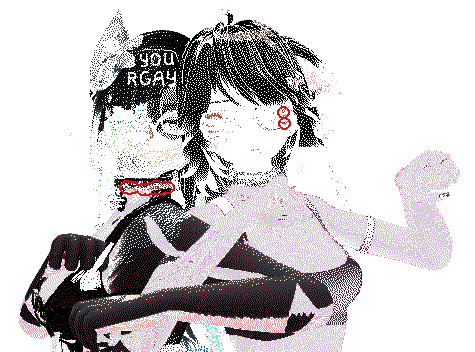

Utilities for wplace. Scroll to bottom for examples and images.

## Table of Contents
- [Features](#Features)
- [Installation](#Installation)
- [Setup](#Setup)
- [Configuration](#Configuration)
- [Examples](#Examples)
  - [fetch_latest_picture.py](#fetch_latest_picture.py)
  - [pixel_locator.py](#pixel_locator.py)
  - [progress_gif_maker.py](#progress_gif_maker.py)

## Features
- Download a given area / canvas
  - Downloads the chunks and crops it to the correct size.
- Compare the downloaded canvas to a template image to get the remaining 
pixels.
- Locate remaining pixels in the canvas (by drawing a circle around pixels of
the given color).
- Create a progress gif of the downloaded images.
- Create a list of the remaining pixel colors and their amount.
- Create a graph of the remaining pixels over time.
- Create a graph of placed pixels per minute (roughly).
  - This can look a bit silly because wplace lets you save up pixels, so
if you take a progress picture shortly before and after placing a lot of
pixels, you get an out-of-place spike. This may be fixed later.


## Installation
Download python 3 or higher [here]. Download or clone this repository,
open a command prompt, and navigate to the root folder.

Then install the necessary packages:
```bash
pip install -r requirements.txt
```

[here]: https://wiki.python.org/moin/BeginnersGuide/Download

## Setup
Copy the `~/configs/example.json` file and rename it to whatever. For example,
`~/configs/mia.json`. Open the file and update the top left coordinate and
image size of the template. Change the value of `data_directory` to something
fitting, like "mia art 1". For more information, see
[Configuration](#Configuration).

The project is made up of multiple runnable files (entry points). The idea
is that you first download the most recent canvas pictures, and then run the
other programs based on the downloaded images.

Run any of the programs once to create the necessary directories. Note: It
will give an error that you're missing a template.png file in your data
directory folder. You can ignore this for now:

```bash
python fetch_latest_picture.py mia
```
Here, the argument you pass is the name of the config file, for example,
`mia` for `mia.json`.

Copy your `template.png` file into the created directory, for example:
`~/mia art 1/template.png`.

Now, run the program again.
```bash
python fetch_latest_picture.py mia
```

Use `--help` to see all the options.
```bash
python fetch_latest_picture.py --help
```

You typically run `fetch_latest_picture.py` before running other programs.

## Configuration
`top_left`: The top left (north-west) corner of your canvas / placed template.

`image_size`: The width and height of the canvas/template.

`data_directory`: The name of the folder in which to save progress images and
other outputs.

`subdirectories`: The name of the subfolders to save files in. This is also
the folder that should contain the template.png.
- `picture`: The folder that will contain the downloaded progress pictures.
- `output`: The folder that graphs and other programmatically-created images
will be saved to.

`bought_colors`: A list of color names. These colors, in combination with the
default free colors, will be used as list of pixel colors to refer to when
making the `remaining_pixels_placeable.png` and 
`remaining_pixels_unplaceable.png` images.


## Examples
These examples presume there exists a config file `~/config/mia.json` where the
`data_directory` is `mia art 1`.

You typically run `fetch_latest_picture.py` before running other programs.

The following `template.png` file has been placed in the `data_directory` folder:  


### fetch_latest_picture.py
```bash
python fetch_latest_picture.py mia
```



Uses the `~/config/mia.json` config file to locate my picture on the wplace
canvas, and downloads the current state of the selected region. In this
example, this image was taken on the 28th of August 2025 at 4:25, and will be
saved to `~/mia art 1/pictures/2025-08-25T04:25:00`.

Then, the downloaded image is compared to the template at
`~/mia art 1/template.png` to find incorrect pixels and a picture of unplaced
pixels is created at `~/mia art 1/outputs/remaining_pixels.png`.
A `remaining_pixels_placeable.png` and `remaining_pixels_unplaceable.png` are
also created.

Finally, the pixels in the created `remaining_pixels.png` file are counted and
saved to `~/mia art 1/outputs/remaining_pixels.txt`, grouped by color and
sorted by the amount of remaining pixels.

Placeable pixels = Free pixels and the colors mentioned in the `bought_colors`
list in the config file.  


Unplaceable pixels = Premium pixels that haven't been bought yet.  


```bash
python fetch_latest_picture.py mia lucy luna --ignore_identical
```
Runs the same fetch command for multiple config files. It will download the
latest picture and compare it to the latest saves picture. If they are
identical, it will discard the downloaded picture, and if they are different,
it will save it instead.

### pixel_locator.py
```bash
python pixel_locator.py mia --pixel_color "Deep Red"
```



Draws circles / hollow blobs around the "Deep Red" pixel color.
These circles are drawn on a copy of the `remaining_pixels.png` picture.  
&nbsp;

```bash
python pixel_locator.py mia --pixel_color "Deep Red" --pixel_color "Red"
```
Draws circles around multiple colors.  
&nbsp;

```bash
python pixel_locator.py mia -p "Deep Red" -p "Red"
```
Use `-p` as shorthand for `--pixel_color`.  
&nbsp;

```bash
python pixel_locator.py mia --pixel_color "Red" --circle_radius 6 --circle_width 2 --circle_color 255,255,0,255 --on-template
```
Draw yellow (RGBA 255,255,0,255 = red + green = yellow) circles with a radius
of 6 and a width of 2. This picture is drawn on a copy of the `template.png`
image, instead of the `remaining_pixels.png` image. 

### progress_gif_maker.py
```bash
python progress_gif_maker.py mia --gif_length 3
```


Make a 3-second long gif from the downloaded progress pictures. This works
best if you have a lot of pictures spread out over time. 3 seconds may be too
little depending on the size of the build. I recommend 2 seconds or something.
Keep in mind a 3-second 6 FPS gif is 18 frames.
